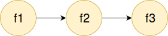
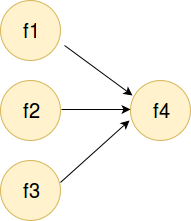
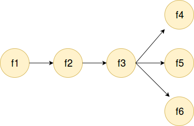
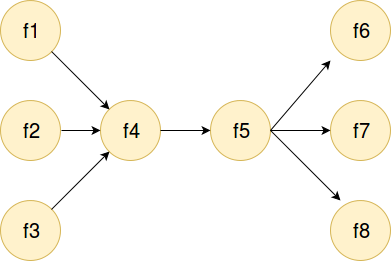
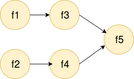

dag has two main concept:
1. **Pipeline** executes the functions sequentially and in order.
2. **Spawns** executes the functions concurrently, so there is no ordering guarantee.

## Example 1
  
```Go
d := dag.New()
d.Pipeline(f1, f2, f3)
d.Run()
```
In the above example, f1 starts first, and after completion, f2 starts then f3.  
Full example : [examples/ex1/ex1.go](examples/ex1/ex1.go)

## Example 2
  
```Go
d := dag.New()
d.Spawns(f1, f2, f3)
d.Run()
```
The order of execution of f1, f2 and f3 is *nondeterministic*  
Full example : [examples/ex2/ex2.go](examples/ex2/ex2.go)

## Example 3
  
In this example f4 must be executed after complition of f1, f2 and f3. You can use **Join** method:
```Go
d := dag.New()
d.Spawns(f1, f2, f3).Join().Pipeline(f4)
d.Run()
```
Full example : [examples/ex3/ex3.go](examples/ex3/ex3.go)

## Example 4
  
After *pipeline* we can use **Then** method:
```Go
d := dag.New()
d.Pipeline(f1, f2, f3).Then().Spawns(f4, f5, f6)
d.Run()
```
Full example : [examples/ex4/ex4.go](examples/ex4/ex4.go)

## Example 5
  
```Go
d := dag.New()
d.Spawns(f1, f2, f3).
	Join().
	Pipeline(f4, f5).
	Then().
	Spawns(f6, f7, f8)
d.Run()
```
Full example : [examples/ex5/ex5.go](examples/ex5/ex5.go)

## Example 6
  
We want to execute two pipeline concrrently, we can use **pipeline.Of** inside the *Spawns* method:
```Go
d := dag.New()
d.Spawns(pipeline.Of(f1, f3), pipeline.Of(f2, f4)).
	Join().
	Pipeline(f5)
d.Run()
```
Full example : [examples/ex6/ex6.go](examples/ex6/ex6.go)

## Example 7
We can use **OnComplete** method after *Pipeline* or *Spawns* to notify when functions has completed.
```Go
d := dag.New()
d.Pipeline(f1, f2).OnComplete(f3).
	  Then().
  Spawns(f1, f2).OnComplete(f4)
d.Run()
```
Full example : [examples/ex7/ex7.go](examples/ex7/ex7.go)
